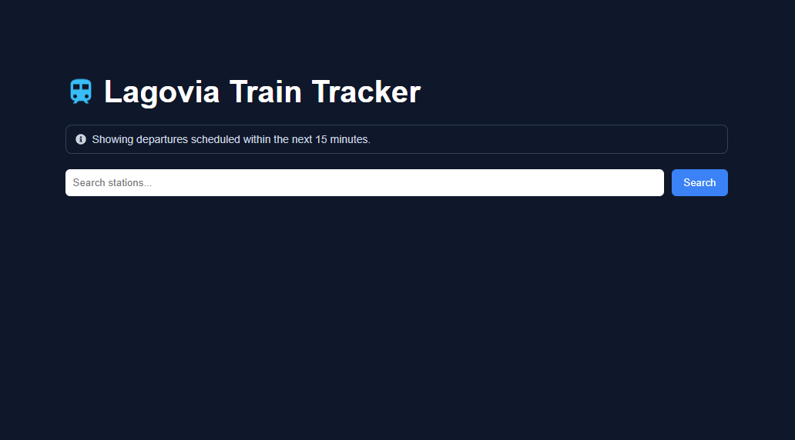
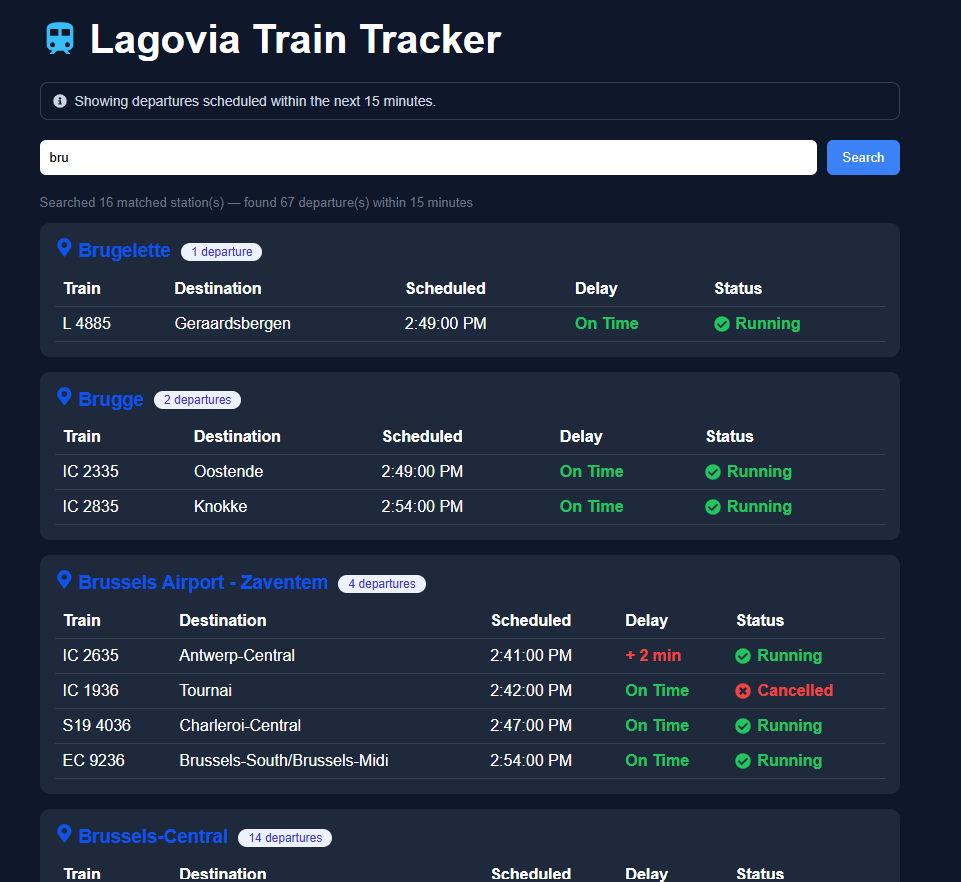
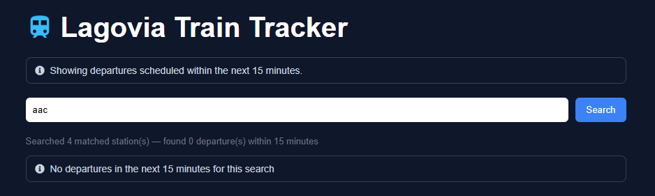

# Lagovia Train Tracker

A  simple web application that shows upcoming train departures from Belgian stations using the [iRail API](https://api.irail.be).

A user types part of a station name (e.g. "Bru") and sees all departures scheduled within the next 15 minutes from every matching station.

---

#  Features

- Search stations by name (minimum 3 characters)
- Fetch live departures from iRail API
- Filter departures within the next **15 minutes**
- Display:
  - Train number
  - Destination
  - Scheduled departure time
  - Delay information
  - Cancellation status
- Parallel API requests for multiple stations
- Loading and error handling states

---
## Tech Stack

- **Backend:** Python, FastAPI, httpx
- **Frontend:** React + Vite
- **Data source:** [iRail API](https://api.irail.be)

---

## How to Install and Run Locally

### Backend (FastAPI)

```bash
cd backend
python -m venv venv
venv\Scripts\activate        # Mac/Linux: source venv/bin/activate
pip install -r requirements.txt
uvicorn main:app --reload
```

Backend runs at: http://localhost:8000  
API docs: http://localhost:8000/docs

### Frontend (React + Vite)

```bash
cd frontend
npm install
npm run dev
```

Frontend runs at: http://localhost:5173

### Run both together

Open two terminals side by side — one for backend, one for frontend.

---

## API

### `GET /departures?q={query}`

Returns all departures from stations matching the search query, scheduled within the next 15 minutes.

**Error responses:**
- **400 INVALID_QUERY** — Search term must be at least 3 characters  
- **200 NO_MATCHING_STATIONS** — No stations match the search query  
- **200 NO_DEPARTURES** — Stations found but no departures within the next 15 minutes  
- **500 UPSTREAM_ERROR** — iRail API unreachable or failed request 

**Query rules:**
- Minimum 3 characters required
- Case-insensitive substring match against station names

**Example request:**

   GET http://localhost:8000/departures?q=Bru
   
## 📦 Response Structure

###  Success Response

Returned when stations are found (with or without departures in the next 15 minutes).

```json
{
  "query": "brussels",
  "matchedStations": 2,
  "stations": [
    {
      "stationName": "Brussels Central",
      "departures": [
        {
          "stationName": "Brussels Central",
          "trainNumber": "IC1234",
          "destination": "Antwerp",
          "scheduledDeparture": "2026-06-22T10:15:00+02:00",
          "actualDeparture": "2026-06-22T10:17:00+02:00",
          "delayMinutes": 2,
          "cancelled": false
        }
      ]
    }
  ]
}
```
 ---  

## Decisions and  trade-offs

 **FastAPI over Express**:
  - FastAPI provides native async support, which fits perfectly with external API calls.
  - Built-in validation and automatic OpenAPI documentation reduce boilerplate.
  - Better performance for concurrent requests compared to a traditional Express setup.


**`asyncio.gather` for parallel fetching**
  When a query matches multiple stations, all liveboard requests are executed simultaneously instead of sequentially.This reduces response time.

**`httpx` over `requests`**  : `requests` is synchronous and blocks the event loop. `httpx` supports async/await natively and works correctly with FastAPI and `asyncio.gather`.

**`zoneinfo` for Belgian timezone**  : Used `ZoneInfo("Europe/Brussels")` instead of  UTC+1 or UTC+2

 **Grouped results by station**:
  - Departures are grouped per station to improve readability.
  - Makes frontend rendering simpler and more structured.
---
 ## Known limitations
 - **No station list caching** — the full station list is fetched from iRail on every request
 - **No auto-refresh** — the user must manually search again to see updated departure times.
---

##  Screenshots

### Home Page



### Departures View


### Search Results - No departure in within 15 minutes

---
